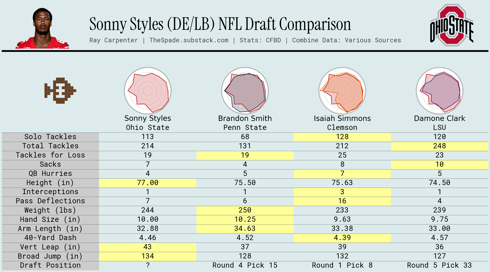

<!-- "Hero" Header -->

  
   
   
  
  <!-- Text Block -->
  

NFL Draft prospect comparison cards built with a k-nearest neighbor (KNN) algorithm. Takes raw combine measurements and college production stats, calculates per-season percentiles, then uses Manhattan distance to find each prospect's 3 most similar historical players.
  

   
  
  
   
   

